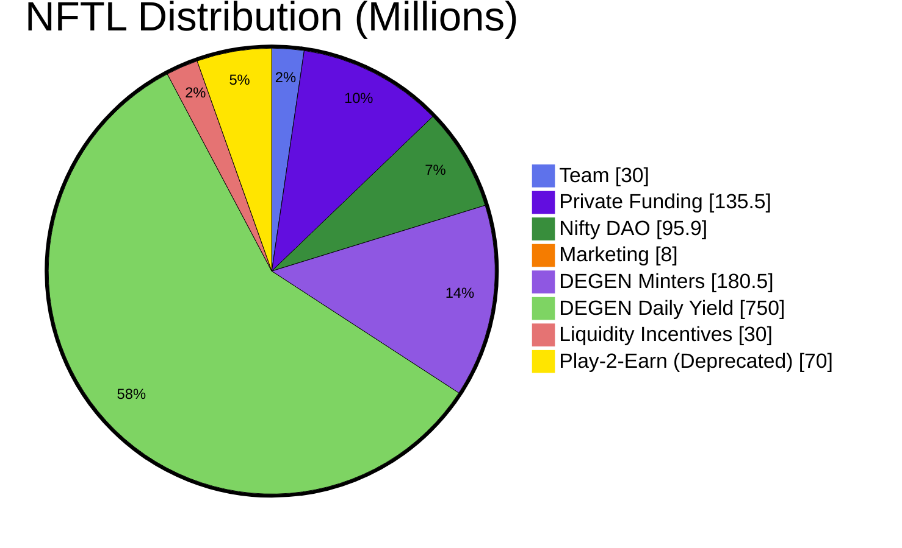

Our launch in September 2021 kicked off the [initial distribution](./distribution) of NFTL.

[Initial supply](./distribution) was set to **450M NFTL** with no declared max supply at the time. However, we expected around 550M NFTL, or 1 Billion in total, to be distributed over the course of the first calendar year (through September 2022), and 250M NFTL annually for the next 2 years.

In total, [NFTL emissions](./emissions) for the first 3 years added up to **850M NFTL**. DEGEN NFT daily emissions end on Sept 14, 2024 - at which point no further emissions are planned unless by order of the Nifty DAO.

After several burn events including 7th tribe claim, raffles and mini-games, the max supply amounts to **1.225B NFTL**. Please check [CoinGecko](https://www.coingecko.com/en/coins/nifty-league) for accurate up-to-date information regarding circulating & total supply.

 

---

Learn more about the initial supply, distributions, emisions on the next pages.
